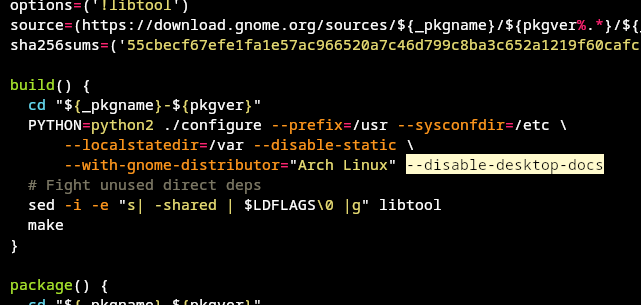

## Tizen Studio Arch Guide

The purpose of this guide is to assist in the installation of Tizen Studio on Arch Linux, specifically the CLI version, although the IDE version should technically work as well. The most challenging aspect of installing Tizen Studio on Arch Linux is dealing with outdated dependencies, such as `gnome-doc-util`, which cannot be compiled.

### How-to
To install Tizen Studio on Arch Linux, follow the steps below:

1. Download the latest version of the Tizen Studio CLI from the Samsung Developer website.
2. Install all the necessary dependencies from the patch by running the following command:

   ```
   yay -S procps-ng gettext dbus curl expect gtk2 grep zip make qemu-user libpng12 webkitgtk2-bin
   ```
   Note: Some dependencies that take a long time to install or are troublesome have been excluded.

   ```
   yay -S webkitgtk2-bin
   ```
   To install `webkitgtk2` binary version, you can compile it yourself by removing the `-bin`.
   
3. Install `debtap` from the AUR repository. 
4. Download the binary for `gnome-doc-utils` from [here](https://packages.ubuntu.com/bionic/gnome-doc-utils) or any other source.
5. Once you have successfully downloaded all the required files, run `debtap gnome-doc-utils*deb`.
6. The command will generate a `.zst` file that can be installed using `pacman`. 
7. Use `pacman -U` to install the generated `.zst` file. **Note that this method is not recommended, and it may break your system.**
8. Install `gnome-desktop2` using `yay` or any other package manager you use. Edit the `PKGBUILD` by adding `--disable-desktop-docs` on `build()`.

   

9. After completing the above steps, apply the patch to this repository:

   ```
   patch -u -b web-cli_Tizen_Studio_5.1_ubuntu-64.bin -i tizen_studio_cli.patch
   ```

10. Finally, run the executable `./web-cli_Tizen_Studio_5.1_ubuntu-64.bin` to complete the installation.

By following these steps, you should be able to install Tizen Studio on Arch Linux successfully.

