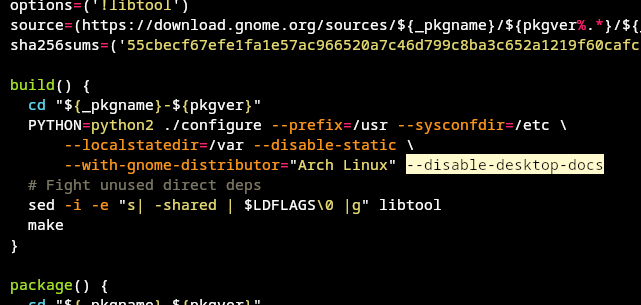

## Tizen Studio Arch ガイド

このガイドの目的は、Tizen Studio CLI版をインストールするためのArch Linuxへのインストール手順を補助することです。IDE版も理論的には動作するはずです。Arch LinuxにTizen Studioをインストールする最も難しい側面は、`gnome-doc-util`などの古い依存関係を扱うことで、これらはコンパイルできないためです。

### 手順

Arch LinuxにTizen Studioをインストールするには、以下の手順に従ってください。

1. Samsung Developerウェブサイトから最新版の[Tizen Studio CLI](https://developer.tizen.org/development/tizen-studio/download)をダウンロードします。
2. 次のコマンドを実行して、パッチから必要なすべての依存関係をインストールします。

   ```
   yay -S procps-ng gettext dbus curl expect gtk2 grep zip make qemu-user libpng12 webkitgtk2-bin
   ```
   注意: インストールに時間がかかるまたは問題がある依存関係は除外されています。

   ```
   yay -S webkitgtk2-bin
   ```
   `webkitgtk2`のバイナリバージョンをインストールするには、`-bin`を削除して自分でコンパイルすることができます。
   
3. AURリポジトリから`debtap`をインストールします。
4. [ここ](https://packages.ubuntu.com/bionic/gnome-doc-utils)または他のソースから`gnome-doc-utils`のバイナリをダウンロードします。
5. 必要なすべてのファイルをダウンロードしたら、`debtap gnome-doc-utils*deb`を実行します。
6. このコマンドにより、`pacman`でインストールできる`.zst`ファイルが生成されます。
7. 生成された`.zst`ファイルをインストールするには、`pacman -U`を使用します。**この方法はお勧めできず、システムを壊す可能性があります。**
8. `yay`または使用している他のパッケージマネージャを使用して`gnome-desktop2`をインストールします。`PKGBUILD`に`--disable-desktop-docs`を追加して、`build()`を編集します。

   

9. 上記の手順を完了したら、このリポジトリにパッチを適用します。

   ```
   patch -u -b web-cli_Tizen_Studio_5.1_ubuntu-64.bin -i tizen_studio_cli.patch
   ```

10. 最後に、実行可能ファイル `./web-cli_Tizen_Studio_5.1_ubuntu-64.bin`を実行してインストールを完了します。

これらの手順に従うこと

